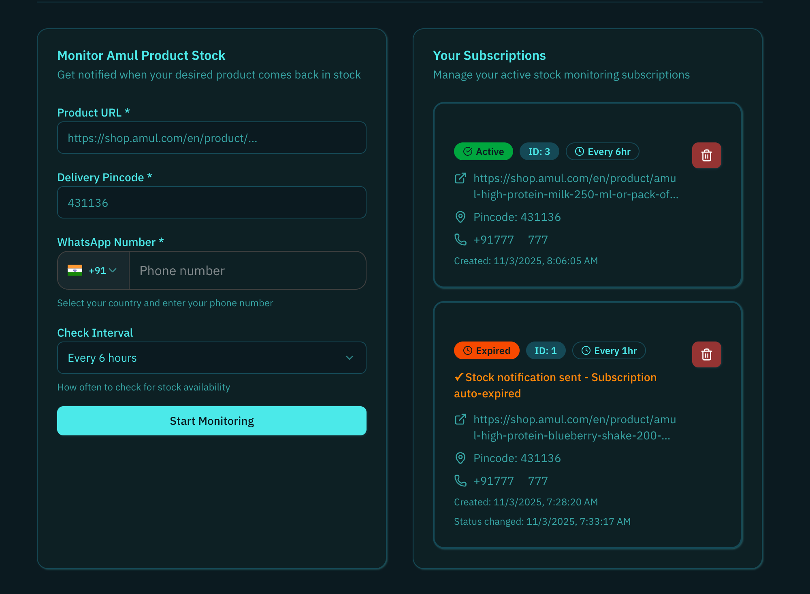

# 🛒 Amul Stock Checker - Frontend

A modern Next.js 15 application for monitoring Amul product stock availability. Users can subscribe to product notifications and receive alerts when items come back in stock. Built with Google OAuth authentication, shadcn/ui components, Tailwind CSS, and next-themes.


## ⚙️ Backend Repository

Stock checks, scheduling, subscription storage, and WhatsApp notifications are handled by the companion backend service.

### [→ View the Amul Stock Checker backend](https://github.com/omshejul/amul-check-stock)

## 📸 Screenshots



*Monitor Amul product stock with an intuitive interface - featuring subscription management, status tracking, and theme switching*

## ✨ Features

- 🛒 **Stock Monitoring** - Track Amul product availability by pincode
- 🔔 **WhatsApp Notifications** - Get notified via WhatsApp when products are back in stock
- 📋 **Subscription Management** - View and manage all your subscriptions with status tracking
- 📊 **Status Tracking** - Active, Expired, and Deleted subscription states
- 📞 **International Phone Support** - Phone input with country code selection and auto-detection
- 🔐 **Google OAuth Authentication** - Secure sign-in with Google accounts
- 🎨 **Modern UI** - Beautiful interface built with shadcn/ui components
- 🌓 **Theme Switching** - Light, dark, and system theme support
- 📱 **Responsive Design** - Works perfectly on all devices
- ⚡ **Next.js 15** - Latest App Router with Turbopack
- 🔒 **Type Safety** - Full TypeScript support
- 🎯 **Accessibility** - WCAG compliant components
- 🌍 **Open Source** - MIT licensed and community-driven

## 🚀 Quick Start

### Prerequisites

- Node.js 18+
- npm, yarn, or pnpm
- Google OAuth credentials

### Installation

1. **Clone the repository**

   ```bash
   git clone https://github.com/omshejul/check-amul-stock-frontend.git
   cd check-amul-stock-frontend
   ```

2. **Install dependencies**

   ```bash
   npm install
   ```

3. **Set up environment variables**

   ```bash
   cp .env.example .env.local
   ```

   Add your configuration to `.env.local`:

   ```env
   # NextAuth Configuration
   NEXTAUTH_URL=http://localhost:3000
   NEXTAUTH_SECRET=your-secret-key-here  # Generate with: openssl rand -base64 32
   
   # Google OAuth Credentials
   GOOGLE_CLIENT_ID=your-google-client-id
   GOOGLE_CLIENT_SECRET=your-google-client-secret
   
   # Backend API Configuration (Server-side only)
   BACKEND_API_URL=http://localhost:3000
   BACKEND_API_BEARER_TOKEN=your-bearer-token-here
   ```

   **Important**: 
   - Make sure the backend API is running before using the stock monitoring features!
   - The backend credentials are **NOT** exposed to the client - they're only used in Next.js API routes

4. **Start the development server**

   ```bash
   npm run dev
   ```

5. **Open your browser**
   Navigate to [http://localhost:3000](http://localhost:3000)

## 🔧 Google OAuth Setup

### 1. Create Google Cloud Project

1. Go to [Google Cloud Console](https://console.developers.google.com/)
2. Create a new project or select existing one
3. Enable the Google+ API

### 2. Configure OAuth Credentials

1. Navigate to "Credentials" → "Create Credentials" → "OAuth 2.0 Client ID"
2. Set application type to "Web application"
3. Add authorized redirect URIs:
   - `http://localhost:3000/api/auth/callback/google` (development)
   - `https://yourdomain.com/api/auth/callback/google` (production)
4. Copy the Client ID and Client Secret to your `.env.local`

## 🏗️ Project Structure

```
check-amul-stock-frontend/
├── app/                          # Next.js App Router pages
│   ├── api/                     # API routes
│   │   ├── auth/                # NextAuth.js authentication
│   │   └── stock-checker/       # Backend proxy API routes
│   │       ├── checks/          # Create/delete subscriptions
│   │       ├── subscriptions/   # Get subscriptions
│   │       └── health/          # Health check
│   ├── auth/signin/             # Custom sign-in page
│   ├── globals.css              # Global styles
│   ├── layout.tsx               # Root layout
│   └── page.tsx                 # Homepage with stock checker
├── components/                  # Reusable components
│   ├── auth/                    # Authentication components
│   │   ├── sign-in-button.tsx
│   │   ├── sign-out-button.tsx
│   │   └── user-profile.tsx
│   ├── stock-checker/           # Stock monitoring components
│   │   ├── stock-checker-form.tsx    # Create subscriptions
│   │   └── subscriptions-list.tsx    # Manage subscriptions
│   ├── providers/               # Context providers
│   │   ├── session-provider.tsx
│   │   └── theme-provider.tsx
│   ├── ui/                      # shadcn/ui components
│   ├── PhoneInput.tsx           # International phone input
│   ├── navbar.tsx               # Navigation bar
│   ├── footer.tsx               # Footer with open source info
│   └── theme-toggle.tsx         # Theme switcher
├── lib/                         # Utilities
│   ├── services/                # API services
│   │   └── stock-checker-api.ts # Backend API client
│   ├── auth.ts                  # NextAuth configuration
│   └── utils.ts                 # Helper functions
├── types/                       # TypeScript definitions
│   ├── stock-checker.ts         # Stock checker types
│   └── next-auth.d.ts           # NextAuth type extensions
└── public/                      # Static assets
```

## 🛒 Stock Monitoring Features

### How It Works

1. **Sign In** - Authenticate with your Google account
2. **Add Product** - Enter Amul product URL, delivery pincode, and phone number
3. **Select Country** - Choose your country code with flag icons and auto-detection
4. **Set Interval** - Choose check frequency: 1hr, 6hr, 12hr, or 24hr (default: 6hr)
5. **Get Notified** - Receive WhatsApp message when product is back in stock
6. **Auto-Expire** - Subscription automatically expires after notification is sent
7. **Manage Subscriptions** - View all subscriptions with status badges and delete active/expired ones

### Subscription States

- **Active** (Green Badge) - Monitoring is running, notifications will be sent
- **Expired** (Orange Badge) - Stock found and notification sent, subscription auto-paused
- **Deleted** (Hidden) - Subscription removed, retained in backend for history

### Backend Integration

This frontend connects to the [Amul Stock Checker Service](https://github.com/omshejul/amul-check-stock) backend through secure Next.js API routes:

**Architecture:**
- Client → Next.js API Routes → Backend Service (with Bearer Token)
- Backend credentials are kept secure on the server-side
- User authentication verified via NextAuth session

**API Endpoints:**
- `POST /api/stock-checker/checks` - Create new stock monitoring subscription
- `GET /api/stock-checker/subscriptions` - Retrieve user's active subscriptions
- `DELETE /api/stock-checker/checks/:id` - Remove subscription
- `GET /api/stock-checker/health` - Check backend health

The backend uses Puppeteer to check product availability and sends notifications via Node-RED webhook.

## 🎨 UI Components

This project uses [shadcn/ui](https://ui.shadcn.com/) for consistent, accessible components:

- **Button** - Interactive elements with variants (destructive, outline, ghost)
- **Card** - Content containers with headers for subscriptions
- **Input** - Form input fields with validation
- **Label** - Accessible form labels
- **Badge** - Status indicators (Active, Expired, Deleted) with color coding
- **Alert** - Success and error messages with icons
- **Avatar** - User profile images with fallbacks
- **Dropdown Menu** - Context menus and navigation
- **Separator** - Visual content separation
- **Select** - Dropdown selectors for intervals and countries
- **PhoneInput** - Custom international phone input with country flags and auto-detection

## 🌓 Theme System

Built with [next-themes](https://github.com/pacocoursey/next-themes):

- **Light Theme** - Clean, bright interface
- **Dark Theme** - Easy on the eyes
- **System Theme** - Follows OS preference
- **Smooth Transitions** - Elegant theme switching

## 🔐 Authentication Flow

1. **Unauthenticated State** - Shows sign-in button
2. **Loading State** - Displays loading spinner
3. **Authenticated State** - Shows user profile and sign-out option
4. **Session Management** - Automatic session handling

## 📱 Responsive Design

- **Mobile First** - Optimized for mobile devices
- **Tablet Support** - Responsive breakpoints
- **Desktop Experience** - Full-featured desktop interface
- **Touch Friendly** - Proper touch targets and gestures

## 🛠️ Available Scripts

```bash
npm run dev          # Start development server
npm run build        # Build for production
npm run start        # Start production server
npm run lint         # Run ESLint
```

## 🧩 Adding New Components

To add new shadcn/ui components:

```bash
npx shadcn@latest add [component-name]
```

Example:

```bash
npx shadcn@latest add dialog
npx shadcn@latest add form
npx shadcn@latest add input
```

## 🔧 Configuration Files

- **`next.config.ts`** - Next.js configuration with image domains
- **`tailwind.config.ts`** - Tailwind CSS configuration
- **`components.json`** - shadcn/ui configuration
- **`.cursorrules`** - Cursor AI project rules

## 🚀 Deployment

### Vercel (Recommended)

1. Push your code to GitHub
2. Connect your repository to Vercel
3. Add environment variables in Vercel dashboard
4. Deploy automatically

### Other Platforms

The app can be deployed to any platform that supports Next.js:

- Netlify
- Railway
- DigitalOcean App Platform
- AWS Amplify

## 🤝 Contributing

Contributions are welcome! Whether you're fixing bugs, adding features, or improving documentation, your help is appreciated.

### How to Contribute

1. **Fork the repository**
   ```bash
   git clone https://github.com/omshejul/check-amul-stock-frontend.git
   ```

2. **Create a feature branch**
   ```bash
   git checkout -b feature/amazing-feature
   ```

3. **Make your changes**
   - Follow the existing code style
   - Add tests if applicable
   - Update documentation as needed

4. **Commit your changes**
   ```bash
   git commit -m 'Add amazing feature'
   ```

5. **Push to your fork**
   ```bash
   git push origin feature/amazing-feature
   ```

6. **Open a Pull Request**
   - Describe your changes clearly
   - Reference any related issues

### Development Guidelines

- Use TypeScript for type safety
- Follow the existing component structure
- Keep components small and reusable
- Add comments for complex logic
- Test your changes thoroughly
- Ensure the app builds without errors

### Areas for Contribution

- 🐛 Bug fixes and improvements
- ✨ New features and enhancements
- 📚 Documentation improvements
- 🎨 UI/UX enhancements
- ♿ Accessibility improvements
- 🌍 Internationalization support
- 🧪 Test coverage

## 📄 License

This project is licensed under the MIT License - see the [LICENSE](LICENSE) file for details.

## 🙏 Acknowledgments

- [Next.js](https://nextjs.org/) - React framework
- [NextAuth.js](https://next-auth.js.org/) - Authentication
- [shadcn/ui](https://ui.shadcn.com/) - UI components
- [Tailwind CSS](https://tailwindcss.com/) - Styling
- [next-themes](https://github.com/pacocoursey/next-themes) - Theme management
- [libphonenumber-js](https://github.com/catamphetamine/libphonenumber-js) - Phone number parsing
- [react-country-flag](https://github.com/danalloway/react-country-flag) - Country flags
- [Lucide React](https://lucide.dev/) - Icon library

## 📞 Support

If you have any questions or need help:

- 📖 Check the [Documentation](https://github.com/omshejul/check-amul-stock-frontend#readme)
- 🐛 [Report Issues](https://github.com/omshejul/check-amul-stock-frontend/issues)
- 💬 [Start a Discussion](https://github.com/omshejul/check-amul-stock-frontend/discussions)
- ⭐ Star the project if you find it useful!

## 🔗 Related Projects

- [Amul Stock Checker Service](https://github.com/omshejul/amul-check-stock) - Backend API with Puppeteer stock checking

## 🌟 Show Your Support

If this project helped you, please consider:

- ⭐ Starring the repository
- 🍴 Forking and contributing
- 📢 Sharing with others
- 🐛 Reporting bugs
- 💡 Suggesting new features

---

**Made with ❤️ by [Om Shejul](https://github.com/omshejul)**

Open Source • MIT Licensed • Contributions Welcome
